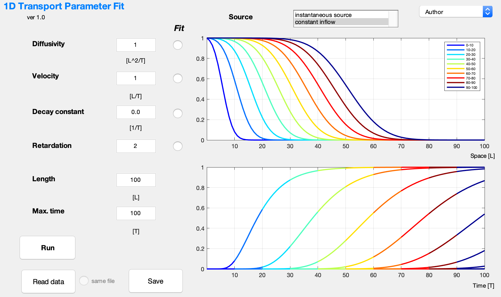
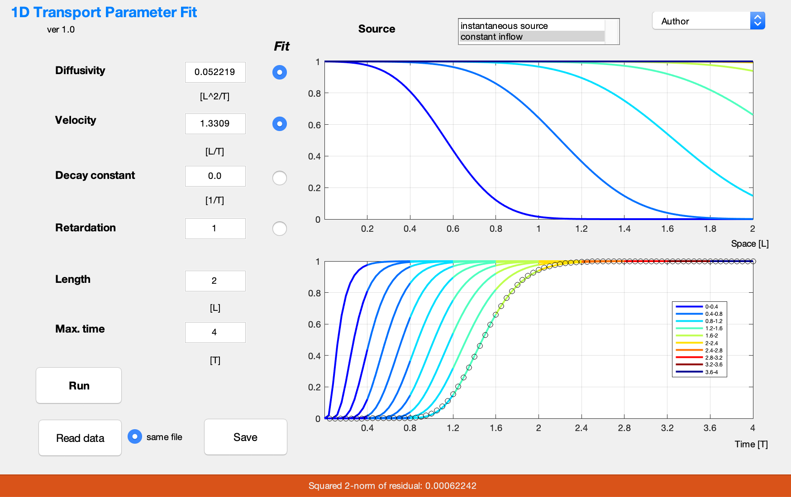

# Visualization of Solute Transport in 1D Free and Porous Media Flow

Ekkehard Holzbecher

*German Univ. of Technology in Oman (GUtech)*

## Introduction

In the real world environment flow of fluids is 3-dimensional (3D), but there are various situations in which a 1D perception is appropriate. Neglecting all velocity variations, fluid flow in rivers, canals, pipes and other conduits may be described by a single average velocity. Column experiments in laboratories are designed to reduce the complexity of flow. In blood vessels flow can be described as 1D. Soil scientists examine seepage in 1D, as the vertical component usually dominates. Similarly the connection between a surface water body and the underlying groundwater is often conceived as 1D. Hydrogeologists often deal with fracture and porous media flow in the sub-surface with the 1D models, abstracting from all existing heterogeneities. Even in aerodynamics the concept of 1D flow can be appropriate, if circumstances are fulfilled in a certain sub-region. In  the technical ansd scientific literature this is referred to as the plug flow.

The migration of a solute or a dissolved substance in a flowing fluid is determined by several processes. Some of these are of physical, others are of chemical, biochemical, geochemical or biogeochemical nature. The processes that govern the fate of an individual species can be grouped in four basic classes: 
* Advection
* Diffusion / dispersion
* Decay / degradation
* Sorption
 
Altogether these determine the transport of a solute or dissolved chemical specie in a fluid. Mathematically this is expressed in a differential equation for the concentration c of the species:

  (1) 

with parameters *R*, *D*, *v* and *λ*. *x* and *t* denote the space and time. Each of the four parameters is related to one of the processes mentioned above. *v* is the velocity that determines advective flux. *D* is the diffusivity that describes diffusive and more general dispersive processes. *λ* is the decay constant describing linear decay or degradation processes. *R* is the retardation factor which emerges from fast ad- and desorption processes. In rivers and streams retardation is also caused by the exchange with retention zones (Marion et al. 2008).    
Concerning the source of the species two basic scenarios have to be distinguished. In one there is an initial concentration that is locally elevated; in the other there is a permanent leaking into the fluid. For 1D flow these are the instantaneous plane source and the constant inflow model cases.    
The instantaneous plane source model is based on the assumption that the initial concentration is infinitely high and located in a single point. While this is physically not possible, mathematically it allows the derivation of an analytical expression for *c* at times *t*>0 after introduction of the specie in the fluid and positions x>0 downstream from the original source:  

  (2) 

According to Häfner et al. (1992) the solution was first derived by Angermann in 1989. *M*0 is the total mass introduced at time *t*=0 at position *x*=0 put into an environment in which the concerned species was not present before. 
In the other generic scenario it is assumed that there is inflow with a constant concentration 

  (3) 

*cin* denotes the concentration at the inflow position *x*=0. The solution was derived by van Genuchten (1981) for a general decay term –*μc* in equation (1). Following Wexler (1992) we use here *μ=λR*. This is based on the assumption that the degradation process is active in the dissolved and in the adsorbed state (Holzbecher 2017).  

## Visualization

The 1D transport simulator software visualizes the spatial and temporal development of a species concentration under the combined influence of all four processes and for both of the source scenarios. A first version was presented by Holzbecher in the textbook ‘Environmental Modeling – using MATLAB’ in 2007 and than extended in the second edition (Holzbecher 2012). Some crucial problems with the numerical implementation of the book versions are overcome as described by Holzbecher (2015).    
The simulator allows the input of the basic parameters in a graphical user interface. In addition to the four process parameters values for the length of the visualized system and the considered time period have to be specified.  Figure 1 depicts the GUI. The GUI also enables the choice of the source model.

#### Figure 1: The Graphical User Interface of the 1D transportfit Simulator

The output is initiated at pressing the ‘Run’ button. It shows concentration profiles and breakthrough curves in two panels. The result for the instantaneous source model with default parameters is given in Figure 2. 

#### Figure 2: Output for the default instantaneous source model

As a real system that is represented by this simulator model one may imagine a column in a laboratory of 1 m length. A fluid is flowing within the column with a velocity of 1 cm/min. The diffusivity is 1 cm2/min. An experiment in the column is run over a time period of 100 min. 
The upper figure shows concentration profiles, i.e. the concentration distribution in a column at 10 time instants during the experiment. The lower figure depicts breakthrough curves, i.e. the concentration development measured at ten sensors equidistantly located along the column. 
The colouring of the curves allows an easy connection between the two figures. Colours are connected with time periods, as given in the legend. The first time period is related to the blue colour, in which the breakthrough curve at the first sensor is steeply rising. The profile at the end of the ‘blue’ period is depicted in the upper figure in the very colour. What follows is a ‘light blue’ period, shown by a colour change of the breakthrough curves. The profile at the end of this period is depicted in light blue in the profile figure. 
The colours help to understand the connection between profile and breakthrough curves. At the observation points at the end of the coloured time periods the same values can be recognized in both figures. In the shown example at the end of ‘blue’ period the concentration at the first downstream sensor is around 0.09, which can be taken from the green curve in the profile figure and from the first breakthrough curve changing colour from blue to light blue. At the same position at the end of the ‘light blue’ period a value of 0.02 for c can be identified in both figures.   
The simulator provides easy visual evaluation of the influence of parameter changes. The example in Figure 3 shows the effect of velocity. The left sub-plots show profile and breakthrough output for the default constant inflow case. On the right the corresponding figures are shown, delivered by the software for an increased velocity *v*=2! The fluid is flowing faster through the 1D system. Thus the profile curves move to the right, while the breakthrough curves are shifted to the left.

  
  

#### Figure 3: Output for the default constant inflow model compared with the case of doubled velocity 

For the default parameter setting (*D*=1, *v*=1, *λ*=0, *R*=1) only the processes of diffusion and advection are considered. Using the transport simulator the additional effect of decay, degradation and sorption processes can be studied. Here two examples are selected for demonstration.  Figure 4 depicts the output when decay is added to the default case with constant inflow. In the profile curves a constant decline of the front maximum can be observed. This is also nicely visualized in the breakthrough curves, which with increasing downstream position reach lower stationary values.  

  

#### Figure 4: Output for the default constant inflow model with additional degradation 

Figure 5 deals with a situation in which sorption processes are involved. Here they induce a retardation *R*=2. The effect on the concentration distributions can be studied using the simulator. In comparison with the default shown on the left side of Figure 3 profiles are shifted to the left, breakthrough curves to the right.  

  

#### Figure 5: Output for the default constant inflow model with additional retardation 

Concerning the physical units the program leaves the choice of length and time units to the user. In the GUI the letter T is used for an arbitrary time unit, the letter L for an arbitrary length unit. The user may choose these freely, but has to follow the choice by entering parameter values. For example: is the length unit is cm and the time unit min, the velocity value has to be given in cm/min, as indicated below the input field. Correspondingly the user has to stick with the T and L choice entering other parameter values. Only the retardation as dimensionless parameter is independent of the unit choice.      
 The 1D transport simulator can be used in many of the above mentioned situations of 1D flow. Using previous knowledge or educated guesses concerning the few parameters the calculated concentration distributions can be of help in various respects. It may serve for the prediction of the spreading of a contaminant. Arrival times can be obtained. It can be checked if concentrations are above a critical limit at arrival. For lab or field experiments researchers obtain hints about the placement of sensors. 
Due to its minimal design and user-friendly implementation the 1D transport simulator is extremely useful teaching transport processes in fields of hydro- and aerodynamics as well as in porous media flow.  

## Parameter Estimation

What was described so far is more precisely referred to as forward modelling. The parameters are known for a certain application in the real world and the simulation predicts the development, here by illustrating profiles and breakthrough curves. However, before one can expect that model produces something meaningful the parameter values must be known. Often some of them are not known. Then a parameter estimation can be performed. The parameter value is then the unknowm. That's why the procedure is also referred to as inverse modeling. 
Parameter estimation requires some observations from the real system as input. Most often this is a series of concentrations, measured at one or several observation points. These may have been obtained from a laboratory or field experiment, or have been measured in the field under certain conditions. These breakthrough curves are input for an algorithm in which the parameter values are adjusted over and over again until the output for forward modeling runs fits with the measured data. 
In the program the user may provide breakthrough curves from several observation points for estimating up to three out of the four of the input parameters (length and time are determined by the field data and are thus not variable). 

#### Figure 6: Parameter estimation run, showing GUI with model output 

Figure 6 shows the graphical user interface and the output. The model was run to estimate diffusivity and velocity: both corresponding buttons are checked. The user may have altered the values for both parameters or used the default settings. What was given there were initial values which are necessary to start the estimation algorithm and the values are overwritten at the successful end of the process by the optimal estimates, the final outcome aim of inverse modelling. 
The given breakthrough curve was measured at position *x*=2, which here correspoind with the end position of the model, in lab experiments often the outlet position. It is depicted in the breakthrough curve figure by black circles. The measured values obviously fit nicely with the simulated ones, that are depicted by the most right curve. As a value for the quality of the fit, the squared 2-norm of the fit is denoted in the bottom ribbon. The residuals denote the differences between measured and modelled values at the observation times. 

Observation data are read from a file. Tthe import of the data is initiated by the 'Read data' button. First a file-select box appears, in which the filename and its directory have to be specified. Using the 'Options' button, one can chose the file-type (EXCEL, ASCII or all with corresponding extensions). Once the file is opened an import select box appears. 

  

#### Figure 7: Input data select box, example for an ascii file and time series import 

Using the curser the user highlights the data that are to be imported. In Figure 7 this is a column containing the time instants at which measurements are available. Change the name to 'tdata' as shown in the figure. Under ïmported dat' select 'Numeric Matrix", before hitting the final (green) checkmark for import. Now proceed in the same way with the other variables: highlight, name and import. Use the name 'cdata' for the measured variable names and 'xdata' for the positions of the observation points. Note that 'cdata' is a matrix, if there is more than one observation point. 
Depending on the file type one may have to check the column delimiters. When reading from a 'csv'-file the delimeter will be set to 'Comma' automatically. For EXCEL files the user may have to adjust the setting. 
Take care that the imported data-sets fulfill the following requirements: the length of 'tdata' corresponds to the size of 'cdata'. If the time instants are stored in column vectors, the observed values are also in a column vector; dito for rows. The number of entries in 'xdata' is equal to the second dimension of 'cdata'. 

Returning back to the transportfit GUI, hit once into the window and push any button. When the corresponding message at the bottom of the interface has disappeared, you can proceed. Check your input data and if everything looks ok, do the modelling by hitting 'Run'. 

'Save' button 
'same file' checkbox

## References 
* Häfner, Frieder, Dietrich Sames, Hans-Dieter Voigt. 1992. “Wärme- und Stofftransport”. Springer Publ., Berlin. https://doi:10.1007/978-3-662-00982-6
* Holzbecher, Ekkehard. 2012. “Environmental Modeling – using MATLAB”, Springer Publ., Heidelberg (2nd ed.). https://doi:10.1007/978-3-642-22042-5 
* Holzbecher, Ekkehard, 2015. “Improved Evaluation of Analytical Solutions of the 1D Transport Equation”, Addendum to Holzbecher, 2012. “Environmental Modeling – using MATLAB”. https://www.researchgate.net/publication/281898072_Improved_Evaluation_of_Analytical_Solutions_of_the_1D_Transport_Equation
* Holzbecher, Ekkehard 2017. “Generalizing the concept of retardation factors”. Toxicological & Environmental Chemistry 9(7-8): 1096-1116. https://doi:10.1080/02772248.2016.1241881
* Marion, Andrea, Mattia Zaramella, Andrea Bottacin-Busolin 2008. “Solute transport in rivers with multiple storage zones: the STIR model”, Water Resources Research 44, W10406. https://doi:10.1029/2008WR007037
* van Genuchten, Martinus Th. 1981. “Analytical solutions for chemical transport with simultaneous adsorption, zero-order production and first-order decay”. J. of Hydrology 49: 213-233. https://doi:10.1016/0022-1694(81)90214-6
* Wexler, Eliezer J. 1992.  “Analytical solutions for one-, two-, and three-dimensional solute transport in groundwater systems with uniform flow”. Techniques of Water-Resources Investigations of the United States Geological Survey, Book 3, Chapter B7. https://pubs.er.usgs.gov/publication/twri03B7
